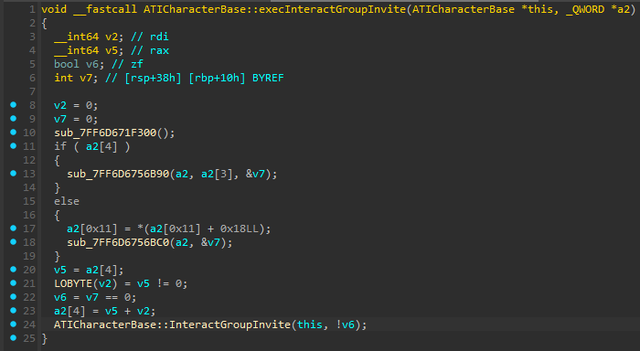
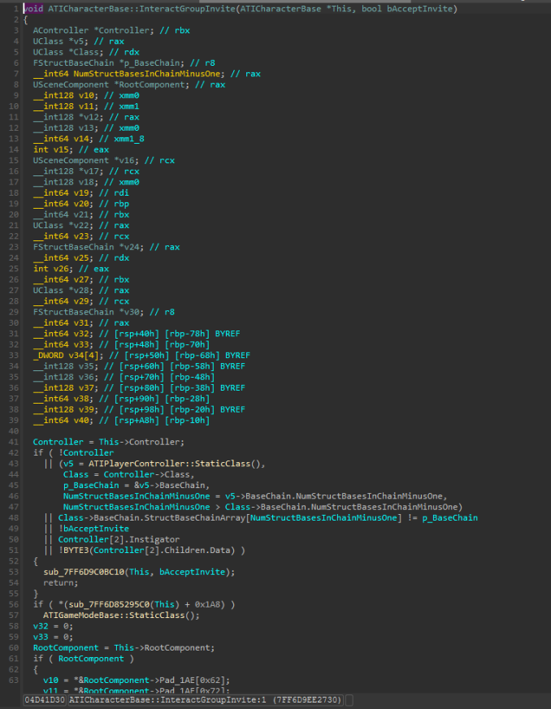

# IDA Exec Functions Importer

Turn a stripped Unreal Engine binary into a database filled with useful names, types, VTables, and native function signatures.

The plugin consumes the `CppSDK` and `IDAMappings` output generated by [Dumper-7](https://github.com/Encryqed/Dumper-7) and imports it directly into IDA Pro.

## What it imports

- Every Unreal `exec` function that has a native implementation
- The complete generated C++ SDK, including its classes, structs, functions, and other types
- Every discovered VTable
- Non-inlined `UClass* USomeType::StaticClass()` functions
- Statically constructed `FName` values, named as `NAME_<StringContent>`
- Important global symbols, including:
  - `GObjects`
  - `GNames`
  - `FName::AppendString`
  - `UObject::ProcessEvent`

| Exec functions | Virtual function tables |
| :---: | :---: |
|  |  |

## From exec thunk to native implementation

Imported exec thunks contain the identity and signature of the native function they wrap. Put the cursor on the native call and press <kbd>Ctrl</kbd>+<kbd>Alt</kbd>+<kbd>Q</kbd>. The plugin resolves the target, applies the proper function name, and transfers the full prototype.

### Before



### After



The result is a substantially more useful decompilation, with Unreal types, fields, globals, and function names restored:


## VTables and class hierarchies

All discovered VTables are named during import. For inheritance-aware virtual-function navigation, hierarchy views, and propagation of names and prototypes across overrides, install [IDA-VTable-Utility](https://github.com/RandomStuffFromAI/IDA-VTable-Utility).

The utility is required for the hierarchy window shown below and is used automatically by the <kbd>Ctrl</kbd>+<kbd>Alt</kbd>+<kbd>Q</kbd> action when the selected target is a virtual call.


## Requirements

- IDA Pro 9.2 or newer
- Hex-Rays Decompiler
- A Dumper-7 output directory containing `CppSDK`, `IDAMappings`, or both
- `idaclang` when importing types from `CppSDK/SDK.hpp` (recommended)
- [IDA-VTable-Utility](https://github.com/RandomStuffFromAI/IDA-VTable-Utility) for inheritance-aware virtual-call handling

## Installation

Download the artifact matching your IDA version from the latest GitHub Actions run, or build the solution locally with the matching [official IDA SDK](https://github.com/HexRaysSA/ida-sdk).

Copy `IDAExecFunctions64.dll` into the `plugins` directory of your latest IDA installation, for example:

```text
C:\Program Files\IDA Professional 9.3\plugins\
```

Restart IDA after copying the plugin.

## Usage

1. Open the target Unreal Engine binary in IDA and allow initial analysis to finish.
2. Press <kbd>Ctrl</kbd>+<kbd>Alt</kbd>+<kbd>D</kbd> to run the importer.
3. Select the top-level Dumper-7 output directory—the directory containing `CppSDK` and `IDAMappings`.
4. Choose a type source:
   - **idaclang** parses `CppSDK/SDK.hpp` and provides the most complete types.
   - **Mappings** creates types from the `.idmap` data.
   - **Don't import types** imports names and symbols only.
5. To recover a native implementation from an exec thunk, place the cursor on the wrapped function call and press <kbd>Ctrl</kbd>+<kbd>Alt</kbd>+<kbd>Q</kbd>.

The importer accepts modern V2 `.idmap` files and legacy V1 identifier streams.

## Building

Clone the official SDK into `IDA-SDK` using the tag that matches your target IDA version:

```powershell
git clone --recursive --branch v9.3.1-release https://github.com/HexRaysSA/ida-sdk.git IDA-SDK
```

The expected layout is:

```text
IDAExecFunctionsImporter\
+-- IDA-SDK\
|   +-- src\
|       +-- include\
|       +-- lib\
+-- IDAExecFunctions64\
+-- IDAExecFunctions64.sln
```

### Visual Studio

1. Open `IDAExecFunctions64.sln` in Visual Studio.
2. Select **Release** and **x64** in the solution configuration toolbar.
3. If Visual Studio asks to retarget the project, select an installed MSVC toolset.
4. Open **Project > Properties > General > Output Directory** and set it to the `plugins` directory of the IDA installation you are building for, for example:

   ```text
   C:\Program Files\IDA Professional 9.3\plugins\
   ```

5. Select **Build > Build Solution** or press <kbd>Ctrl</kbd>+<kbd>Shift</kbd>+<kbd>B</kbd>.

The resulting `IDAExecFunctions64.dll` is written to the configured output directory. Restart IDA after building if it was already open.

### Command line

From a Visual Studio Developer PowerShell prompt:

```powershell
msbuild IDAExecFunctions64.sln /m /p:Configuration=Release /p:Platform=x64
```

Use the SDK tag matching the IDA version you intend to support. The included GitHub Actions workflow builds separate artifacts for IDA 9.2, 9.3, and 9.4/latest.

## `.idmap` V1 record format

Legacy mapping files contain a stream of variable-length identifier records:

```cpp
struct Identifier
{
    uint32 Offset; // Relative to image base
    uint16 NameLength;
    const char Name[NameLength]; // Not null-terminated
};
```

## IDMap visualizer

The repository also includes a standard-library-only Python/Tkinter visualizer for modern `.idmap` files and legacy identifier streams:

```powershell
python tools\idmap_visualizer.py path\to\file.idmap
```

For parser-only inspection without opening the GUI:

```powershell
python tools\idmap_visualizer.py path\to\file.idmap --dump-json
```
